# 🚀 Enterprise-Grade Three-Tier Web Application on AWS EKS

[](https://www.linkedin.com/in/ernest-shongwe/)
[](https://discord.com/invite/jdzF8kTtw2)
[](https://medium.com/@shongwe.bhekizwe)
[](https://github.com/bshongwe)
[](https://aws.amazon.com)
[](https://www.terraform.io)
[](https://kubernetes.io)
[](https://www.docker.com)
[](https://jenkins.io)


## 🌟 Overview

This repository demonstrates a **production-ready, enterprise-grade three-tier web application** deployment on AWS EKS, showcasing modern DevSecOps practices and cloud-native technologies. The project implements a complete CI/CD pipeline with automated security scanning, monitoring, and GitOps workflows.

### 🏗️ Architecture Components

**Frontend Tier (Presentation Layer)**
- React.js 17.0.2 with Material-UI components
- Responsive design with modern CSS styling
- Container-based deployment with health checks

**Backend Tier (Application Layer)**
- Node.js 14 with Express.js framework
- RESTful API with CRUD operations
- Comprehensive health check endpoints (`/healthz`, `/ready`, `/started`)
- MongoDB integration with Mongoose ODM

**Database Tier (Data Layer)**
- MongoDB 4.4.6 with persistent storage
- Kubernetes persistent volumes for data persistence
- Authentication and authorization controls

## 📋 Table of Contents

- [🏗️ Architecture Overview](#️-architecture-overview)
- [🛠️ Technology Stack](#️-technology-stack)
- [📁 Project Structure](#-project-structure)
- [🚀 Quick Start](#-quick-start)
- [🔧 Prerequisites](#-prerequisites)
- [📦 Installation & Setup](#-installation--setup)
- [🏃‍♂️ Running the Application](#️-running-the-application)
- [🔐 Security Features](#-security-features)
- [📊 Monitoring & Observability](#-monitoring--observability)
- [🔄 CI/CD Pipeline](#-cicd-pipeline)
- [☁️ Cloud Infrastructure](#️-cloud-infrastructure)
- [🎯 Best Practices](#-best-practices)
- [🐛 Troubleshooting](#-troubleshooting)
- [📖 API Documentation](#-api-documentation)
- [🤝 Contributing](#-contributing)
- [📄 License](#-license)

## 🏗️ Architecture Overview

### 🎯 High-Level Architecture Diagram


### 🏢 Detailed Infrastructure Components


### 📊 Data Flow Architecture


### 🔄 CI/CD Pipeline Flow

```mermaid
flowchart TD
    START([Developer Commits Code]) --> GIT_CLONE[Clone Repository]
    GIT_CLONE --> CLEAN[Clean Workspace]
    CLEAN --> SONAR_SCAN[SonarQube Analysis]
    SONAR_SCAN --> QUALITY_GATE{Quality Gate Pass?}
    QUALITY_GATE -->|No| FAIL[❌ Pipeline Failed]
    QUALITY_GATE -->|Yes| OWASP_SCAN[OWASP Dependency Check]
    OWASP_SCAN --> TRIVY_FS[Trivy File System Scan]
    TRIVY_FS --> DOCKER_BUILD[Docker Image Build]
    DOCKER_BUILD --> ECR_PUSH[Push to ECR]
    ECR_PUSH --> TRIVY_IMG[Trivy Image Scan]
    TRIVY_IMG --> SECURITY_CHECK{Security Scan Pass?}
    SECURITY_CHECK -->|No| FAIL
    SECURITY_CHECK -->|Yes| UPDATE_MANIFEST[Update K8s Manifest]
    UPDATE_MANIFEST --> GIT_PUSH[Push to GitOps Repo]
    GIT_PUSH --> ARGOCD_SYNC[ArgoCD Sync]
    ARGOCD_SYNC --> DEPLOY[Deploy to EKS]
    DEPLOY --> HEALTH_CHECK[Health Check]
    HEALTH_CHECK --> SUCCESS([✅ Deployment Complete])
    
    %% Styling
    classDef startEnd fill:#47a248,stroke:#333,stroke-width:2px,color:#fff
    classDef process fill:#61dafb,stroke:#333,stroke-width:2px,color:#000
    classDef decision fill:#ffa500,stroke:#333,stroke-width:2px,color:#000
    classDef fail fill:#dc3545,stroke:#333,stroke-width:2px,color:#fff
    classDef success fill:#28a745,stroke:#333,stroke-width:2px,color:#fff
    
    class START,SUCCESS startEnd
    class GIT_CLONE,CLEAN,SONAR_SCAN,OWASP_SCAN,TRIVY_FS,DOCKER_BUILD,ECR_PUSH,TRIVY_IMG,UPDATE_MANIFEST,GIT_PUSH,ARGOCD_SYNC,DEPLOY,HEALTH_CHECK process
    class QUALITY_GATE,SECURITY_CHECK decision
    class FAIL fail
```



### 🌐 Network Architecture Details


### 🔧 Simple Component View

```
┌─────────────────────────────────────────────────────────────────┐
│                           AWS EKS Cluster                       │
├─────────────────────────────────────────────────────────────────┤
│  ┌─────────────────┐  ┌─────────────────┐  ┌─────────────────┐  │
│  │   Frontend      │  │    Backend      │  │   Database      │  │
│  │   (React.js)    │  │   (Node.js)     │  │   (MongoDB)     │  │
│  │   Port: 3000    │  │   Port: 3500    │  │   Port: 27017   │  │
│  └─────────────────┘  └─────────────────┘  └─────────────────┘  │
│           │                     │                     │         │
│           └─────────────────────┼─────────────────────┘         │
│                                 │                               │
├─────────────────────────────────┼─────────────────────────────────┤
│              Application Load Balancer (ALB)                    │
│                     (Internet-facing)                           │
└─────────────────────────────────────────────────────────────────┘
```

### 🌐 Network Architecture

- **Internet Gateway**: Provides internet access
- **Application Load Balancer**: Routes traffic to appropriate services
- **Kubernetes Ingress**: Manages external access to services
- **Services**: ClusterIP services for internal communication
- **Persistent Storage**: EBS volumes for database persistence

## 🛠️ Technology Stack

### Core Technologies
| Component | Technology | Version | Purpose |
|-----------|------------|---------|---------|
| Frontend | React.js | 17.0.2 | User interface |
| Backend | Node.js | 14 | API server |
| Database | MongoDB | 4.4.6 | Data persistence |
| Container | Docker | Latest | Containerization |
| Orchestration | Kubernetes | Latest | Container orchestration |

### DevOps & Cloud Tools
| Tool | Purpose | Configuration |
|------|---------|---------------|
| AWS EKS | Container orchestration | Production-ready cluster |
| Jenkins | CI/CD Pipeline | Automated builds & deployments |
| Terraform | Infrastructure as Code | AWS resource provisioning |
| ArgoCD | GitOps | Continuous deployment |
| SonarQube | Code quality analysis | Static code analysis |
| Trivy | Security scanning | Container & file system scans |
| Prometheus | Monitoring | Metrics collection |
| Grafana | Observability | Dashboard & alerting |
| Helm | Package management | Kubernetes deployments |

## 📁 Project Structure

```
📦 end-2-end-k8s-3-tier-dev-sec-ops-project
├── 📁 Application-Code/
│   ├── 📁 frontend/
│   │   ├── 📁 src/
│   │   │   ├── App.js                 # Main React component
│   │   │   ├── Tasks.js              # Task management logic
│   │   │   └── services/
│   │   │       └── taskServices.js   # API service layer
│   │   ├── Dockerfile                # Frontend container config
│   │   └── package.json             # Frontend dependencies
│   └── 📁 backend/
│       ├── index.js                 # Express server entry point
│       ├── db.js                    # MongoDB connection
│       ├── 📁 models/
│       │   └── task.js              # Task data model
│       ├── 📁 routes/
│       │   └── tasks.js             # API route handlers
│       ├── Dockerfile               # Backend container config
│       └── package.json            # Backend dependencies
├── 📁 Jenkins-Pipeline-Code/
│   ├── Jenkinsfile-Frontend         # Frontend CI/CD pipeline
│   └── Jenkinsfile-Backend          # Backend CI/CD pipeline
├── 📁 Jenkins-Server-TF/
│   ├── ec2.tf                      # EC2 instance configuration
│   ├── vpc.tf                      # VPC and networking
│   ├── iam-*.tf                    # IAM roles and policies
│   └── tools-install.sh            # Automated tool installation
├── 📁 Kubernetes-Manifests-file/
│   ├── ingress.yaml               # ALB ingress configuration
│   ├── 📁 Frontend/
│   │   ├── deployment.yaml        # Frontend deployment
│   │   └── service.yaml          # Frontend service
│   ├── 📁 Backend/
│   │   ├── deployment.yaml        # Backend deployment
│   │   └── service.yaml          # Backend service
│   └── 📁 Database/
│       ├── deployment.yaml        # MongoDB deployment
│       ├── service.yaml          # MongoDB service
│       ├── pv.yaml               # Persistent volume
│       ├── pvc.yaml              # Persistent volume claim
│       └── secrets.yaml          # Database credentials
└── 📁 assets/
    └── Three-Tier.gif            # Architecture diagram
```

## 🚀 Quick Start

### 1. Clone the Repository
```bash
git clone https://github.com/bshongwe/end-2-end-k8s-3-tier-dev-sec-ops-project.git
cd end-2-end-k8s-3-tier-dev-sec-ops-project
```

### 2. Local Development Setup
```bash
# Backend setup
cd Application-Code/backend
npm install
npm start

# Frontend setup (in another terminal)
cd ../frontend
npm install
npm start
```

### 3. Docker Deployment
```bash
# Build and run with Docker Compose
docker-compose up -d
```

## 🔧 Prerequisites

### System Requirements
- **OS**: Linux (Ubuntu 22.04 LTS recommended)
- **Memory**: Minimum 8GB RAM
- **CPU**: 4+ cores recommended
- **Storage**: 50GB+ available space

### Required Tools
- [AWS CLI](https://aws.amazon.com/cli/) (v2.0+)
- [kubectl](https://kubernetes.io/docs/tasks/tools/) (v1.28+)
- [Docker](https://docs.docker.com/get-docker/) (v20.0+)
- [Terraform](https://www.terraform.io/downloads.html) (v1.0+)
- [Node.js](https://nodejs.org/) (v14+)
- [Git](https://git-scm.com/) (v2.30+)

### AWS Account Requirements
- AWS Account with appropriate permissions
- IAM User with programmatic access
- S3 bucket for Terraform state storage
- DynamoDB table for state locking

## 📦 Installation & Setup

### 1. AWS Configuration
```bash
# Configure AWS CLI
aws configure
# AWS Access Key ID: YOUR_ACCESS_KEY
# AWS Secret Access Key: YOUR_SECRET_KEY
# Default region name: us-east-1
# Default output format: json
```

### 2. Infrastructure Provisioning
```bash
# Navigate to Terraform directory
cd Jenkins-Server-TF

# Initialize Terraform
terraform init

# Plan deployment
terraform plan -var-file="variables.tfvars"

# Apply configuration
terraform apply -var-file="variables.tfvars"
```

### 3. EKS Cluster Setup
```bash
# Create EKS cluster
eksctl create cluster --name three-tier-cluster --region us-east-1

# Update kubeconfig
aws eks update-kubeconfig --name three-tier-cluster --region us-east-1
```

### 4. Application Deployment
```bash
# Create namespace
kubectl create namespace three-tier

# Deploy database
kubectl apply -f Kubernetes-Manifests-file/Database/

# Deploy backend
kubectl apply -f Kubernetes-Manifests-file/Backend/

# Deploy frontend
kubectl apply -f Kubernetes-Manifests-file/Frontend/

# Deploy ingress
kubectl apply -f Kubernetes-Manifests-file/ingress.yaml
```

## 🏃‍♂️ Running the Application

### Local Development
```bash
# Start MongoDB (if running locally)
mongod

# Start backend server
cd Application-Code/backend
npm start
# Server running on http://localhost:3500

# Start frontend development server
cd Application-Code/frontend
npm start
# Frontend running on http://localhost:3000
```

### Production Deployment
```bash
# Check deployment status
kubectl get pods -n three-tier

# Check service endpoints
kubectl get svc -n three-tier

# Access application via load balancer
kubectl get ingress -n three-tier
```

## 🔐 Security Features

### Container Security
- **Base Image Security**: Using official, minimal base images
- **Trivy Scanning**: Automated vulnerability scanning
- **Non-root User**: Containers run as non-privileged users
- **Resource Limits**: CPU and memory constraints applied

### Network Security
- **Private Subnets**: Database tier isolated in private subnets
- **Security Groups**: Restrictive firewall rules
- **TLS Encryption**: HTTPS/TLS for all communications
- **Network Policies**: Kubernetes network segmentation

### Application Security
- **OWASP Dependency Check**: Third-party library vulnerability scanning
- **SonarQube Analysis**: Static code analysis for security issues
- **Secrets Management**: Kubernetes secrets for sensitive data
- **Authentication**: MongoDB authentication enabled

### Infrastructure Security
- **IAM Roles**: Principle of least privilege
- **VPC Security**: Isolated network environment
- **EKS Security**: Kubernetes RBAC implementation
- **Audit Logging**: CloudTrail and EKS audit logs

## 📊 Monitoring & Observability

### Health Checks
The application implements comprehensive health checks:

**Backend Health Endpoints:**
- `/healthz` - Liveness probe (server running)
- `/ready` - Readiness probe (dependencies available)
- `/started` - Startup probe (initialization complete)

**Frontend Health Checks:**
- Container health checks via HTTP requests
- Resource usage monitoring

### Metrics & Monitoring
- **Prometheus**: Metrics collection and alerting
- **Grafana**: Visualization dashboards
- **Application Metrics**: Custom business metrics
- **Infrastructure Metrics**: Node and cluster metrics

### Logging Strategy
- **Centralized Logging**: ELK stack or CloudWatch
- **Application Logs**: Structured JSON logging
- **Audit Logs**: Security and access logging
- **Error Tracking**: Comprehensive error monitoring

## 🔄 CI/CD Pipeline

### Pipeline Features
- **Automated Testing**: Unit, integration, and security tests
- **Code Quality Gates**: SonarQube quality checks
- **Security Scanning**: Trivy and OWASP dependency checks
- **Image Building**: Docker image creation and optimization
- **ECR Integration**: Private container registry
- **GitOps Deployment**: ArgoCD automated deployments

### Pipeline Stages

**Frontend Pipeline** (`Jenkinsfile-Frontend`)
1. **Workspace Cleanup** - Clean build environment
2. **Source Checkout** - Clone repository
3. **Code Analysis** - SonarQube static analysis
4. **Quality Gates** - Quality threshold validation
5. **Security Scanning** - OWASP dependency check
6. **File System Scan** - Trivy file system scanning
7. **Docker Build** - Container image creation
8. **ECR Push** - Image registry upload
9. **Image Scanning** - Trivy container image scan
10. **Deployment Update** - GitOps repository update

**Backend Pipeline** (`Jenkinsfile-Backend`)
- Similar stages with backend-specific configurations
- Additional database connectivity tests
- API endpoint validation

### Environment Variables
```bash
# Jenkins Pipeline Variables
SCANNER_HOME=tool 'sonar-scanner'
AWS_ACCOUNT_ID=credentials('ACCOUNT_ID')
AWS_ECR_REPO_NAME=credentials('ECR_REPO1')
AWS_DEFAULT_REGION='us-east-1'
REPOSITORY_URI="${AWS_ACCOUNT_ID}.dkr.ecr.${AWS_DEFAULT_REGION}.amazonaws.com/"
```

## ☁️ Cloud Infrastructure

### AWS Services Used
- **EKS** - Managed Kubernetes service
- **EC2** - Compute instances
- **VPC** - Virtual private cloud
- **ALB** - Application load balancer
- **ECR** - Container registry
- **EBS** - Persistent storage
- **CloudWatch** - Monitoring and logging
- **IAM** - Identity and access management

### Resource Specifications
**EKS Cluster:**
- Node group: t3.medium instances
- Auto-scaling: 1-3 nodes
- Kubernetes version: 1.28+

**Jenkins Server:**
- Instance type: t2.2xlarge
- Storage: 30GB EBS volume
- Security group: Ports 22, 8080, 9000, 9090, 80

**Database:**
- MongoDB 4.4.6 container
- Persistent volume: 1Gi
- Resource limits: 0.1GB WiredTiger cache

## 🎯 Best Practices

### Code Quality
- **Linting**: ESLint for JavaScript
- **Formatting**: Prettier for code formatting
- **Testing**: Jest for unit testing
- **Documentation**: Comprehensive inline documentation

### Container Best Practices
- **Multi-stage builds**: Optimized image sizes
- **Security scanning**: Automated vulnerability checks
- **Resource limits**: CPU and memory constraints
- **Health checks**: Proper liveness and readiness probes

### Kubernetes Best Practices
- **Namespace isolation**: Logical resource separation
- **Resource quotas**: Prevent resource exhaustion
- **Network policies**: Secure pod-to-pod communication
- **ConfigMaps/Secrets**: Proper configuration management

### Security Best Practices
- **Least privilege**: Minimal required permissions
- **Encryption**: Data at rest and in transit
- **Regular updates**: Automated security patching
- **Audit logging**: Comprehensive activity logging

## 🐛 Troubleshooting

### Common Issues

**1. Database Connection Issues**
```bash
# Check MongoDB service
kubectl get svc -n three-tier
kubectl logs -f deployment/mongodb -n three-tier

# Verify connection string
kubectl get secret mongo-sec -n three-tier -o yaml
```

**2. Image Pull Errors**
```bash
# Check ECR authentication
aws ecr get-login-password --region us-east-1 | docker login --username AWS --password-stdin <account>.dkr.ecr.us-east-1.amazonaws.com

# Verify image exists
aws ecr describe-images --repository-name frontend --region us-east-1
```

**3. Ingress Controller Issues**
```bash
# Check ALB controller
kubectl get pods -n kube-system | grep aws-load-balancer-controller

# Verify ingress status
kubectl describe ingress mainlb -n three-tier
```

**4. Application Health Check Failures**
```bash
# Check backend health endpoints
kubectl port-forward svc/api 3500:3500 -n three-tier
curl http://localhost:3500/healthz
curl http://localhost:3500/ready
```

### Debugging Commands
```bash
# Pod status and logs
kubectl get pods -n three-tier
kubectl logs -f <pod-name> -n three-tier

# Service connectivity
kubectl get svc -n three-tier
kubectl port-forward svc/<service-name> <local-port>:<service-port> -n three-tier

# Resource usage
kubectl top pods -n three-tier
kubectl top nodes

# Event monitoring
kubectl get events -n three-tier --sort-by=.metadata.creationTimestamp
```

## 📖 API Documentation

### Base URL
```
Production: https://your-domain.com/api
Development: http://localhost:3500/api
```

### Endpoints

**Health Check Endpoints**
```http
GET /healthz
GET /ready
GET /started
```

**Task Management API**
```http
GET    /api/tasks           # Get all tasks
POST   /api/tasks           # Create new task
PUT    /api/tasks/:id       # Update task
DELETE /api/tasks/:id       # Delete task
```

### Request/Response Examples

**Create Task**
```bash
curl -X POST http://localhost:3500/api/tasks \
  -H "Content-Type: application/json" \
  -d '{"task": "Learn Kubernetes", "completed": false}'
```

**Response**
```json
{
  "_id": "64a1b2c3d4e5f6789012345",
  "task": "Learn Kubernetes",
  "completed": false,
  "__v": 0
}
```

## 🤝 Contributing

We welcome contributions! Please follow these guidelines:

### Development Workflow
1. Fork the repository
2. Create a feature branch (`git checkout -b feature/amazing-feature`)
3. Commit your changes (`git commit -m 'Add amazing feature'`)
4. Push to the branch (`git push origin feature/amazing-feature`)
5. Open a Pull Request

### Code Standards
- Follow existing code style and conventions
- Write comprehensive tests for new features
- Update documentation for any changes
- Ensure all CI/CD checks pass

### Pull Request Guidelines
- Provide clear description of changes
- Include screenshots for UI changes
- Reference related issues
- Ensure backwards compatibility

## 📈 Performance Optimization

### Frontend Optimization
- **Code Splitting**: React.lazy for component loading
- **Bundle Optimization**: Webpack configuration
- **Caching**: Browser caching strategies
- **CDN**: Static asset delivery

### Backend Optimization
- **Database Indexing**: MongoDB query optimization
- **Connection Pooling**: Database connection management
- **Caching**: Redis for session management
- **Rate Limiting**: API request throttling

### Infrastructure Optimization
- **Auto-scaling**: Horizontal pod autoscaling
- **Resource Requests**: Proper CPU/memory allocation
- **Node Optimization**: Instance type selection
- **Network Optimization**: VPC and subnet design

## 📊 Metrics & KPIs

### Application Metrics
- **Response Time**: API endpoint performance
- **Error Rate**: Application error tracking
- **Throughput**: Requests per second
- **Availability**: Uptime percentage

### Infrastructure Metrics
- **CPU Utilization**: Node and pod resource usage
- **Memory Usage**: Memory consumption tracking
- **Network I/O**: Network traffic analysis
- **Storage Usage**: Persistent volume utilization

### Business Metrics
- **User Engagement**: Task creation/completion rates
- **Feature Usage**: API endpoint usage statistics
- **Performance Trends**: Historical performance data

## 🔮 Future Enhancements

### Planned Features
- [ ] **User Authentication**: JWT-based authentication
- [ ] **Role-Based Access Control**: RBAC implementation
- [ ] **Real-time Updates**: WebSocket integration
- [ ] **Mobile App**: React Native mobile application
- [ ] **Microservices**: Service decomposition
- [ ] **Service Mesh**: Istio implementation

### Infrastructure Improvements
- [ ] **Multi-region Deployment**: Cross-region redundancy
- [ ] **Disaster Recovery**: Automated backup and restore
- [ ] **Cost Optimization**: Reserved instances and spot pricing
- [ ] **Advanced Monitoring**: Distributed tracing with Jaeger

## 📄 License

This project is licensed under the **Apache License 2.0** - see the [LICENSE](LICENSE) file for details.

```
Licensed under the Apache License, Version 2.0 (the "License");
you may not use this file except in compliance with the License.
You may obtain a copy of the License at

    http://www.apache.org/licenses/LICENSE-2.0

Unless required by applicable law or agreed to in writing, software
distributed under the License is distributed on an "AS IS" BASIS,
WITHOUT WARRANTIES OR CONDITIONS OF ANY KIND, either express or implied.
See the License for the specific language governing permissions and
limitations under the License.
```

## 🙏 Acknowledgments

- **AWS** for providing comprehensive cloud services
- **CNCF** for Kubernetes and cloud-native technologies
- **Open Source Community** for the amazing tools and libraries
- **DevOps Community** for sharing knowledge and best practices

---

**⭐ If you find this project helpful, please consider giving it a star!**

**📧 Questions or suggestions? Feel free to open an issue or reach out via the social links above.**

---

*Built with ❤️ by Ernest B. Shongwe*
